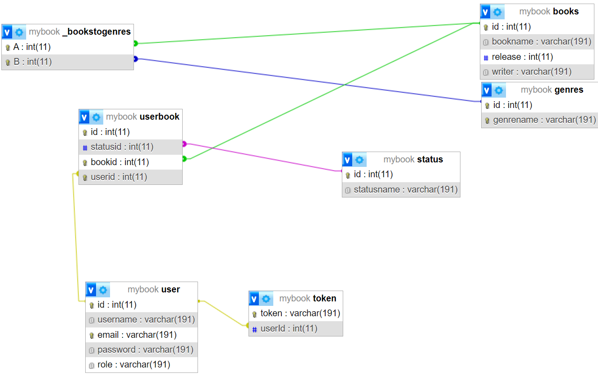

# Dokumentáció

## Telepítő lista

### Prismával való adatbázis kezeléshezhez

```sh
npx prisma
```
### Nestjs install

```sh
npm i -g @nestjs/cli
```

### Belépéshez és regisztrációhoz szükséges telepítések

```sh
nest g module auth
```

```sh
nest g service auth
```

```sh
nest g controller auth
```

```sh
npm install argon2
```

```sh
npm install --save @nestjs/passport passport passport-local
```

```sh
npm install --save-dev @types/passport-local
```

```sh
npm i passport-http-bearer
```

### Dokumentációhoz szükséges telepítés

```sh
npm install --save @nestjs/swagger
```
## Adatmodell

### User tábla

A tábla a felhasználokat adja meg. Kapcsolatban van a **UserBook** táblával ami a személyes könyvtárat jelképezi.
Ezen kívül csatlakozik a **Token** táblához, ami a belépéshez kell.

| Adatnév | Adatfajta | Csatlakozás | Leírás |
| ----------- | ----------- |  ----------- | ----------- |
| Id | Int | UserBook, Token | Felhasználó id-ja ami alapján azonosítani lehet |
| Username | String | ----------- | A felhasználó neve ami nem egyed |
| Email | String | ----------- | A felhasználó emailje ami egyedi |
| Password | String | ----------- | A felhasználó jelszava |
| Role | String | ----------- | A felhasználó engedélye, alapból sima felhasználó |

### Books tábla

A tábla a könyv és annak adatait alkotja meg. A könyvek csatlakoznak a **BookstoGenres** táblához, ami több a több kapcsolattal egy könyvhöz több műfajt is rakhat. Csatlakozik a **UserBook** táblához így lehetővé teszi, a személyes könytvár létrehozásását.

| Adatnév | Adatfajta | Csatlakozás | Leírás |
| ----------- | ----------- |  ----------- | ----------- |
| Id | Int | UserBook, BookstoGenres | A könyveket csatolja a felhasználó könyvtárhoz, és több a több kapcsolattal a műfajokhoz |
| Book name | String | ----------- | A könyv neve ami nem egyedi |
| Writer | String | ----------- | A könyv írója ami nem egyedi
| Release date | Number | ----------- | A könyv kiadási éve |

### BookstoGenres tábla

A csatlakozó tábla, amit lehetővé teszi a több a több kapcsolatot a könyvek és műfajok között.

| Adatnév | Adatfajta | Csatlakozás | Leírás |
| ----------- | ----------- |  ----------- | ----------- | 
| BookId | Int | Books | Össze köti id alapján a könyvekkel |
| GenreId | Int | Genre | Össze köti id alapján a műfajokkal |


### Token tábla

A token tábla lehetővé teszi a belépést.

| Adatnév | Adatfajta | Csatlakozás | Leírás |
| ----------- | ----------- |  ----------- | ----------- |
| Token | String | ----------- | Token id-ja ami egy string, belépéskor megkapja a felhasználó |
| UserId | Int | User | A felhasználókkal való kapcsolatot teszi lehetővé |

### Status tábla

A **Userbook** táblában a megadott könyvekhez státuszt ad.

| Adatnév | Adatfajta | Csatlakozás | Leírás |
| ----------- | ----------- |  ----------- | ----------- |
| Status Id | int | UserBook | Ez adja meg az adott könyvnek a státuszát |
| Genre Name | String | ----------- | A műfaj neve | 

### UserBook tábla

Ez a tábla adja meg mindenkinek a saját könyvtárát, értékeléssel, státusszal.

| Adatnév | Adatfajta | Csatlakozás | Leírás |
| ----------- | ----------- |  ----------- | ----------- |
| id | Int | ----------- | A könyvtárnak az idja ami alapján megtaláljuk |
| StatusId | Int | Status | A státuszokat adja meg adott könyveknek |
| BookId | Int | Book | A könyveket adja meg a könyvtárba |
| UserId | Int | User | Megadja, hogy melyik felhasználóé a könyvtár |




